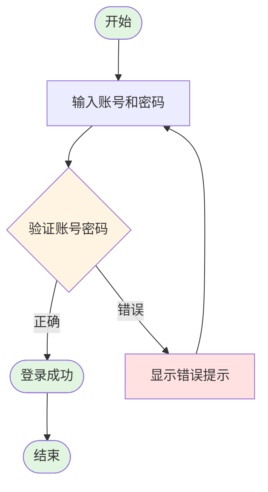

# 用户登录流程图

```mermaid
flowchart TD
    A([开始]) --> B[输入账号和密码]
    B --> C{验证账号密码}
    C -->|正确| D([登录成功])
    C -->|错误| E[显示错误提示]
    E --> B
    D --> F([结束])

    style A fill:#e1f5e1
    style D fill:#e1f5e1
    style F fill:#e1f5e1
    style C fill:#fff4e1
    style E fill:#ffe1e1
```

## 流程说明

1. **开始** - 用户进入登录页面
2. **输入账号和密码** - 用户填写登录信息
3. **验证账号密码** - 系统检查凭证是否正确
4. **登录成功** - 验证通过，跳转到首页
5. **显示错误提示** - 验证失败，提示用户重新输入
6. **结束** - 流程完成