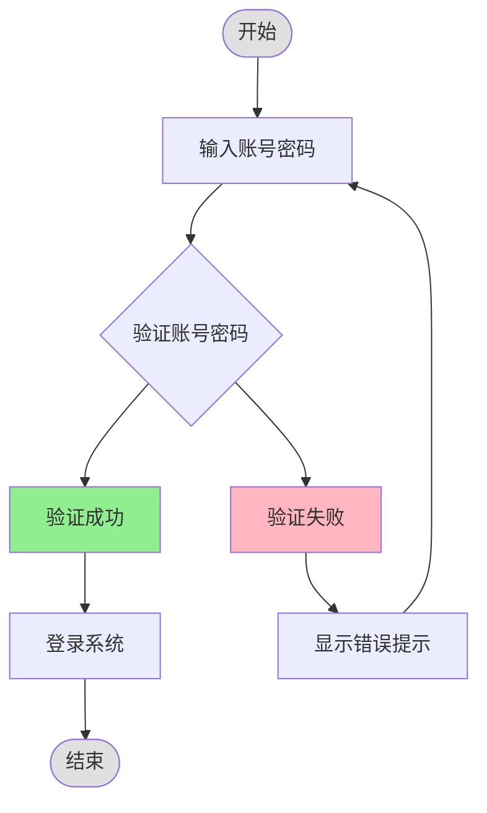

# 用户登录流程

```mermaid
flowchart TD
    Start([开始]) --> Input[输入账号密码]
    Input --> Validate{验证账号密码}
    Validate --> Success[验证成功]
    Validate --> Fail[验证失败]
    Success --> Login[登录系统]
    Fail --> Error[显示错误提示]
    Error --> Input
    Login --> End([结束])
    
    style Success fill:#90EE90
    style Fail fill:#FFB6C1
    style Start fill:#E0E0E0
    style End fill:#E0E0E0
```